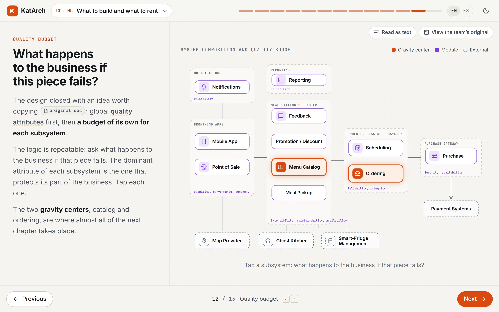
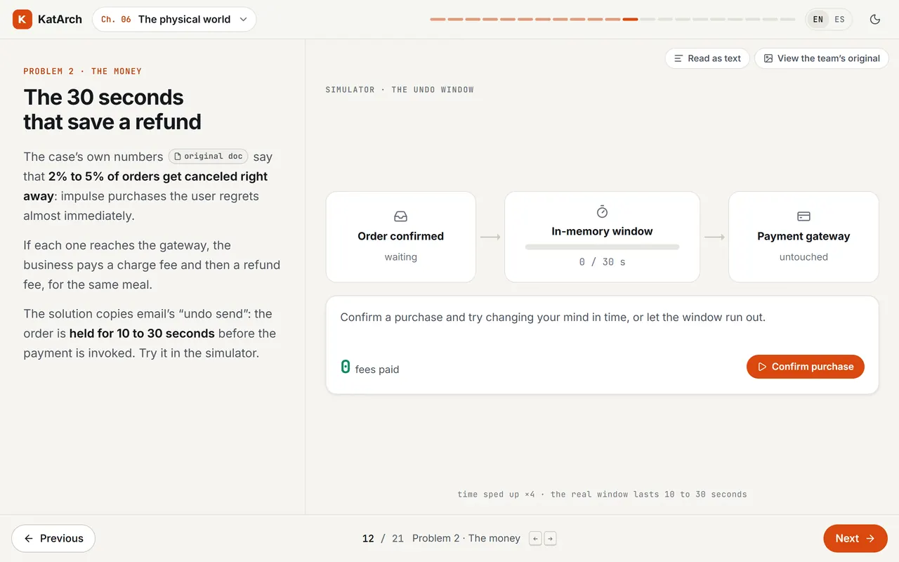
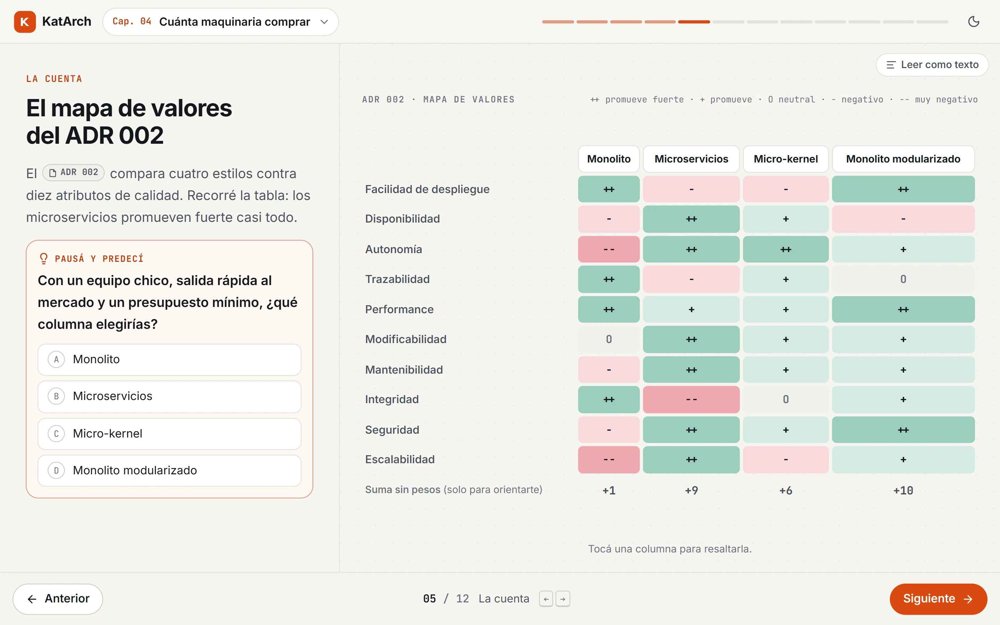
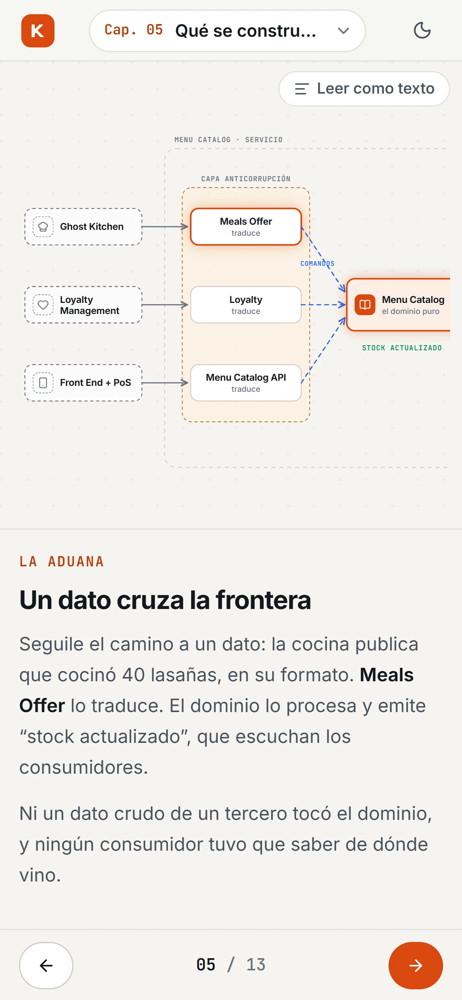

# KatArch

A guided course that rebuilds, step by step, how the winning team of the O'Reilly Software Architecture Kata (Fall 2020, Farmacy Food) reasoned its way to an architecture.

**[Live course](https://katarch.vercel.app)** · **[Case study](https://anderssonfelix.com/work/katarch/)** · **Author: [Felix Andersson](https://anderssonfelix.com)**

<picture>
  <source media="(prefers-color-scheme: dark)" srcset="docs/screenshots/katarch-demo-dark.webp">
  
</picture>

## What it is

In 2020 ten teams answered the same brief: an ordering system for a ghost kitchen that sells meals through smart fridges and staffed kiosks. KatArch follows the winning team, [ArchColider](https://github.com/TheKataLog/ArchColider), through its decisions in the order they were made: the business, the constraints, the guiding principles, the architecture style (a modular monolith), the domain split and the physical-world problems (concurrent fridges, payments, offline pickup). It is written for developers who have not studied software architecture, and every claim points back to the team's public repository: their diagrams, documents and ADRs open one click away, in the original English or in a Spanish translation.

The course shows one idea per screen. The team's figures are redrawn as native, animated diagrams that assemble as you advance, with "pause and predict" questions before key decisions and small interactive simulators. The interface and course text are in English by default, with a Spanish (Rioplatense) version. Chapters 1 to 6 are live; chapters 7 to 11 (the subscriber journey, cloud infrastructure, yearly cost, the decision map and a field guide) are listed on the course map as under construction.

## Gallery

<table>
  <tr>
    <td width="50%" valign="top">
      <picture>
        <source media="(prefers-color-scheme: dark)" srcset="docs/screenshots/katarch-composition-dark.webp">
        
      </picture>
      <br><sub>Every subsystem gets its own quality budget. Selecting one explains what the business loses if it fails.</sub>
    </td>
    <td width="50%" valign="top">
      <picture>
        <source media="(prefers-color-scheme: dark)" srcset="docs/screenshots/katarch-undo-demo-dark.webp">
        
      </picture>
      <br><sub>A simulator for the team's undo window: an order is held 10 to 30 seconds before payment, so an early cancel costs no fees.</sub>
    </td>
  </tr>
  <tr>
    <td width="50%" valign="top">
      <picture>
        <source media="(prefers-color-scheme: dark)" srcset="docs/screenshots/katarch-valuemap-dark.webp">
        
      </picture>
      <br><sub>ADR 002's value map, with a prediction question before the team's answer is shown.</sub>
    </td>
    <td width="50%" valign="top" align="center">
      <picture>
        <source media="(prefers-color-scheme: dark)" srcset="docs/screenshots/katarch-mobile-dark.webp">
        
      </picture>
      <br><sub>On a phone the diagram stacks above the text; steps change by swipe.</sub>
    </td>
  </tr>
</table>

## How it's built

- **A step is data, and diagrams persist across steps.** Each chapter is a typed array of steps in `v2/src/content/<locale>/<chapter>.ts`, one file per locale (`en/`, `es/`; types in `v2/src/content/types.ts`): a title, short text blocks and `visual: { scene, state }`. The `Player` island (`v2/src/components/Player.tsx`) keys the diagram by scene name, so consecutive steps that share a scene keep it mounted and only change its `state`. The diagram transforms in place instead of being swapped for a new figure.
- **A small SVG diagram kit.** `v2/src/visuals/kit.tsx` provides nodes positioned by their center and animated with springs, arrows, traveling messages and a stepper; 49 scenes built on it are registered in `v2/src/visuals/index.ts`. A fixed color alphabet runs through every scene (blue for commands, green for events, violet for stateful components, dashed grey for pre-existing external systems, red for failures). Timed sequences go through `v2/src/visuals/usePhases.ts`, which jumps straight to the final phase when the reader prefers reduced motion.
- **Evidence and a text reading next to every diagram.** A step can declare `evidence` (the team's original image, behind "View the team’s original") and `describe` (a plain-language reading of the diagram, behind "Read as text"). Step changes are announced through an `aria-live` region; navigation works with arrow keys, Page Up/Down, Home/End and touch swipe, and each step has a deep link (`#step-N`, or `#paso-N` in Spanish).
- **Each page ships only the sources it cites.** The original documents, rendered to HTML, are about 390 KB of data. `v2/src/lib/refs.ts` scans a chapter's content for `data-concept` and `data-doc` references and its decision blocks at build time, and passes only those concepts, documents and ADRs to that chapter's island.
- **Primary sources rendered at build time.** `scripts/generate-original-docs.mjs` renders 39 of the team's markdown files (23 documents and all 16 ADRs) with micromark and GFM, rewrites relative links and images to the team's GitHub repository, and pairs each one with its Spanish translation from `prose/docs-es/`. The output is a typed data file, so documents open in an in-page drawer (with an original/translation toggle in the Spanish version) and a link to the file on GitHub.

Reading progress per chapter is kept in `localStorage` (`v2/src/lib/progress.ts`), and the course map offers to resume where the reader left off.

## Stack

- Astro 7 static site with React 19 islands, Motion for animation, Lucide icons, TypeScript, Inter and JetBrains Mono via Fontsource, plain CSS with light and dark themes.
- **Hosting:** Vercel.

## Getting started

The course lives in `v2/` and needs Node 22.12 or later.

```bash
cd v2
npm install
npm run dev       # http://localhost:4321
npm run build     # static site in v2/dist
npm run preview
```

Deployment on Vercel is driven by `vercel.json`.

To regenerate the rendered documents, clone [ArchColider](https://github.com/TheKataLog/ArchColider) into `fall-2020-farmacy-food/ArchColider/` (gitignored) and run `node scripts/generate-original-docs.mjs`. It writes `src/data/article/original-docs.ts`; `v2/src/content/original-docs.ts` is a copy of that file.

## Project structure

```
katarch/
├── v2/                         # the course
│   ├── src/pages/              # course map + one static route per chapter
│   ├── src/content/en/, es/    # chapter steps per locale (typed data)
│   ├── src/content/            # course map, concepts, decisions, original docs
│   ├── src/visuals/            # diagram kit and per-chapter scenes
│   ├── src/components/         # Player island, drawer, text blocks, theme toggle
│   └── src/lib/                # per-chapter source slicing, progress
├── src/data/article/            # generated original documents (copied into v2)
├── prose/                      # editorial source per chapter; docs-es/ holds the document translations
├── scripts/                    # original-document generator
└── vercel.json                 # deployment
```

## Docs

- [`v2/README.md`](v2/README.md): the course internals, the diagram alphabet and how to add a chapter.
- [`ADR-001-pedagogical-strategy-and-web-platform.md`](ADR-001-pedagogical-strategy-and-web-platform.md): why the project follows one team chronologically, and its platform decisions.
- [`PRODUCT.md`](PRODUCT.md) and [`DESIGN.md`](DESIGN.md): audience and editorial constraints.
- [`prose/README.md`](prose/README.md) (Spanish): the editorial method each chapter is written from.

## Attribution

An independent teaching project built on public material from the competition. The original documents, diagrams and ADRs belong to team ArchColider and the other participating teams, published under [TheKataLog](https://github.com/TheKataLog), and are cited and linked where they are used. Theoretical references: *Fundamentals of Software Architecture* (Mark Richards and Neal Ford) and *Software Systems Architecture: Working with Stakeholders Using Viewpoints and Perspectives* (Nick Rozanski and Eoin Woods).
